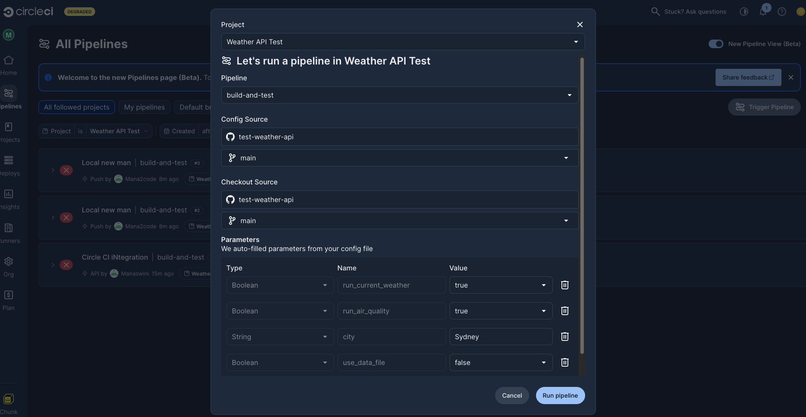
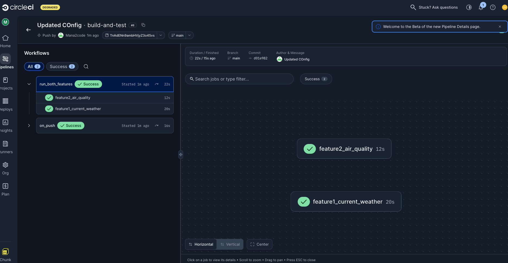
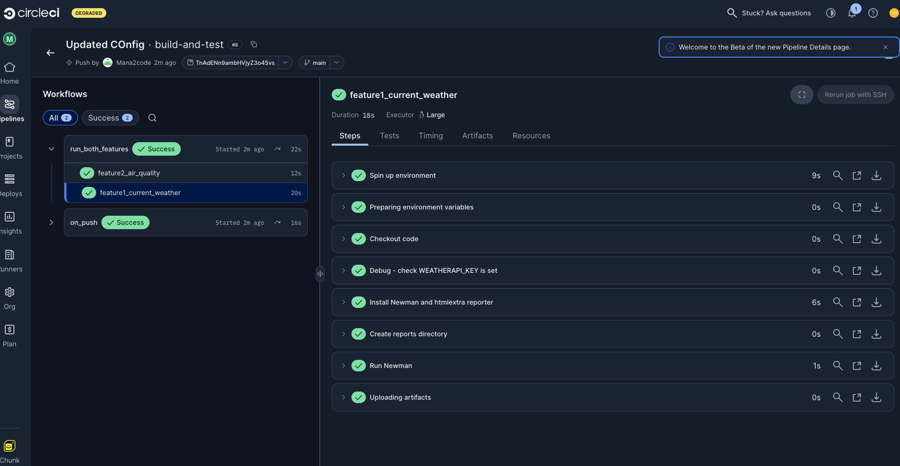
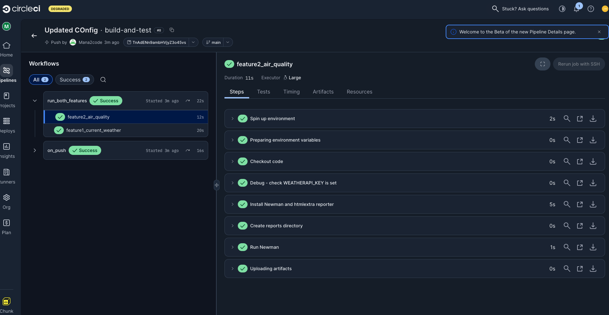

# Test Run Evidence

These screenshots were captured during the CircleCI pipeline run for the WeatherAPI test suite. Pipeline #8, triggered by a push to main from the Mana2code account.

---

## 1. Pipeline Overview — Both Jobs Passing

**File:** `images/ProjectCircleCI.png`

Both jobs ran as part of the `run_both_features` workflow and completed successfully. `feature2_air_quality` finished in 12 seconds and `feature1_current_weather` in 20 seconds. The `on_push` workflow also triggered on the same commit and passed. Branch was `main`, commit `d01e982`, message "Updated COnfig". Total pipeline duration was 22 seconds.

---

## 2. Parameter Selection — Manual Trigger

**File:** `images/ParameterSelection.png`

This shows the Trigger Pipeline dialog in CircleCI. The parameters were auto-populated from the `config.yml` file. Both `run_current_weather` and `run_air_quality` were set to `true`, city was set to `Sydney`, and `use_data_file` was set to `false`. This is how you control which feature runs and which city to test without touching any code.

---

## 3. Feature 1 — Current Weather Job Steps

**File:** `images/GetWeather.png`

The `feature1_current_weather` job ran for 18 seconds. All steps completed successfully — environment setup, checkout, the WEATHERAPI_KEY debug check, Newman install, reports directory creation, the Newman run itself, and artifact upload. The job used a Large executor.

---

## 4. Feature 2 — Air Quality Job Steps

**File:** `images/AirQuality.png`

The `feature2_air_quality` job ran for 11 seconds. Same steps as Feature 1, all green. Newman install took 5 seconds, the actual test run completed in 1 second. Artifacts were uploaded successfully at the end.

---

## Summary

| Job | Status | Duration |
|---|---|---|
| feature1_current_weather | Passed | 20s |
| feature2_air_quality | Passed | 12s |

Both features were triggered by a push to `main` and ran without any failures.